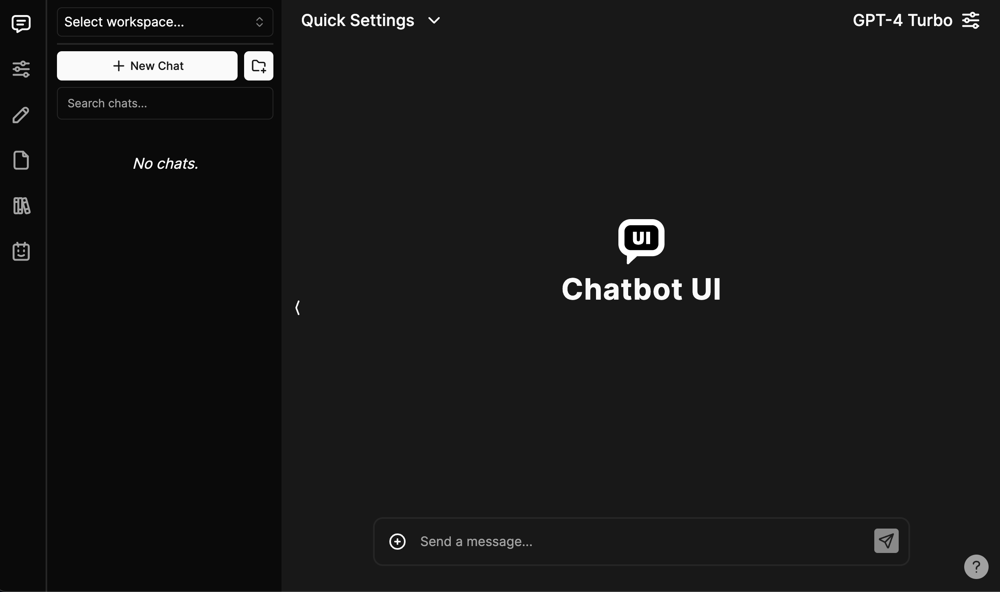

# Integrated Chatbot Web Application

## Overview

This project focuses on developing a chatbot web application similar to ChatGPT, with features that allow switching between different models from different companies and creating intelligent agents for handling specific tasks. The application will leverage language models, web development technologies and APIs.

The web will basically look like this:

### Features
- **Model Switching**: Ability to switch between various LLMs from different companies(e.g., GPT,  ChatGLM, LLaMA etc.), enabling users to choose the best model for their needs.
- **Agent Creation**: Custom agents can be created for specific tasks or specialized conversations (e.g., Q&A, code generation, content summarization).
- **Responsive Front-End**: An interactive and user-friendly web interface for interacting with the chatbot, allowing you to change parameters like output length, model temperature, and more. 

## Application Architecture

### Front-End
The front-end is built using web technologies including:

**Gradio**: A powerful Python-based library used to create customizable user interfaces. It simplifies the integration of machine learning models into web applications with minimal code, offering a clean, intuitive interface for users to interact with the chatbot.

### Back-End
The back-end integrates Language Models using:
- **Hugging Face Models**: Support for various pre-trained models through the Hugging Face API.
- **OpenAI API**: For advanced LLMs like GPT-4.
- **Local Language Models**: utilizing locally hosted language models on the server.

#### Datasets

- **Instrction Tuning:** The **Alpaca** dataset is a high-quality resource for fine-tuning large language models, comprising instruction-output pairs, this dataset was generated using OpenAI's text-davinci-003 API (I use the gpt4 version), covering a wide range of natural language processing tasks such as question answering, text generation, and code writing.

## Temporary URL

[IntegratedChatbot (gradio.live)](https://49e3e77d3d84dc124f.gradio.live/)

## License

## Acknowledgements
